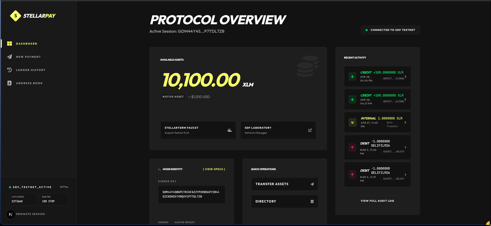
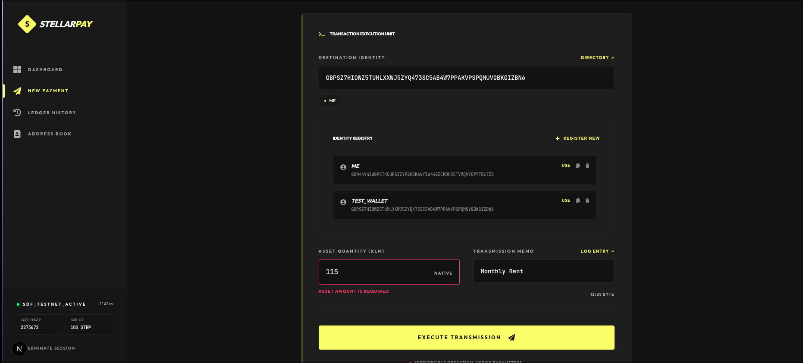
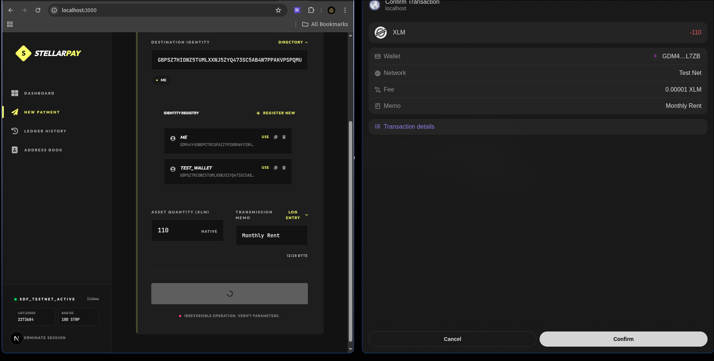
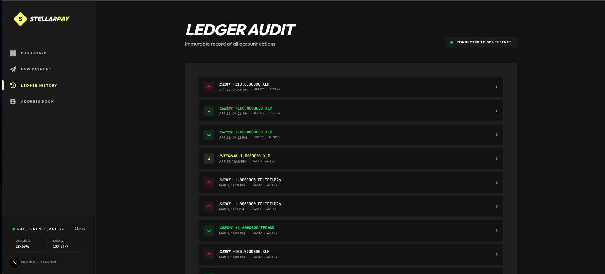
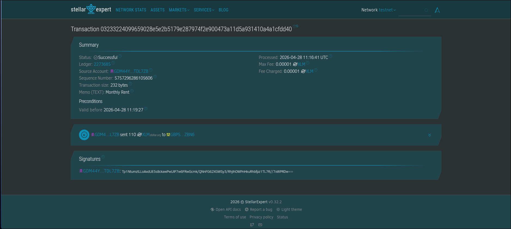

# Stellar Payment App - White Belt Challenge

A modernized, high-performance Stellar payment terminal built for the Stellar White Belt Challenge. This application provides a "ClickHouse" terminal-grade aesthetic with a focus on speed, visibility, and robust data flow.

---

### **Project Status & Compliance**
- **Challenge Level**: Level 1 (White Belt)
- **Status**: Completed
- **Submission Date**: April 27, 2026
- **Last Refinement**: April 26, 2026

---

## 🚀 Key Features

- **High-Performance Terminal UI**: A high-contrast, terminal-grade aesthetic optimized for focus and speed.
- **Wallet Orchestration**: Connect/disconnect Stellar wallets via the Freighter API.
- **Real-Time Telemetry**: Live network monitoring showing current ledger, base fee, and latency metrics.
- **Identity Registry**: A persistent address book to manage frequent recipient identities.
- **Transmission Presets**: Save and load common memo templates for recurring transactions.
- **Quick Select UX**: Instant 1-click selection for contacts and memos directly from the transmission unit.
- **Safety Validations**: Real-time on-chain balance verification and "Insufficient Funds" prevention.
- **Smart History**: Intelligent ledger audit that distinguishes between DEBIT, CREDIT, and INTERNAL self-transfers.

## 📸 Technical Showcase

### **1. Dashboard (Telemetry & Protocol Overview)**
*Real-time network status and available XLM balance display.*


### **2. Transmission Execution Unit (Payment Form)**
*Streamlined payment form featuring "Quick Select" bubbles for contacts and memos.*


### **3. Transaction Confirmation**
*Success state feedback after a verified protocol execution.*


### **4. Immutable Audit Log**
*Detailed transaction history with intelligent labeling.*


### **5. Block Explorer Verification**
*On-chain verification of the transaction via Stellar Expert.*


---

## 🛠️ Tech Stack

- **Core**: [Next.js 14](https://nextjs.org/) (App Router)
- **Language**: [TypeScript](https://www.typescriptlang.org/)
- **Animation**: [Framer Motion](https://www.framer.com/motion/)
- **Blockchain**: [@stellar/stellar-sdk](https://github.com/stellar/js-stellar-sdk)
- **Wallet API**: [@stellar/freighter-api](https://github.com/stellar/freighter)
- **Typography**: Outfit & JetBrains Mono

---

## 🚀 Getting Started

### **Prerequisites**
- Node.js 18.0+
- [Freighter Wallet](https://www.freighter.app/) extension installed

### **Installation**
1. Clone the repository:
   ```bash
   git clone <repo-url>
   cd stellar-payment-app
   ```
2. Install dependencies:
   ```bash
   npm install
   ```
3. Launch development environment:
   ```bash
   npm run dev
   ```
4. Access the terminal at `http://localhost:3000`.

---

## 📖 Operational Guide

1. **Connect Wallet**: Use the connection unit to authorize the Freighter extension on **Testnet**.
2. **Fund Identity**: Use the "SDF Laboratory" or "StellarTerm Faucet" links to acquire testnet XLM.
3. **Execute Transmission**:
   - Enter a Destination Identity (G...).
   - Use **Quick Select** bubbles to instantly populate from your saved registry.
   - Enter the XLM amount (Safety validation will prevent exceeding your balance).
   - Click **Execute Transmission** and sign the request in your wallet.
4. **Audit**: Review the success message and click the explorer link to verify the ledger entry.

---

## 📝 Compliance Checklist (Level 1)

- [x] **Wallet Setup**: Freighter integration on Stellar Testnet.
- [x] **Wallet Connection**: Robust connect/disconnect logic with auto-reconnection.
- [x] **Balance Handling**: Live fetch with USD conversion and error states.
- [x] **Transaction Flow**: verified payment execution with success/failure feedback and hash display.
- [x] **Documentation**: Clean README with screenshots and setup instructions.

---

**Developed for the Stellar White Belt Challenge.**